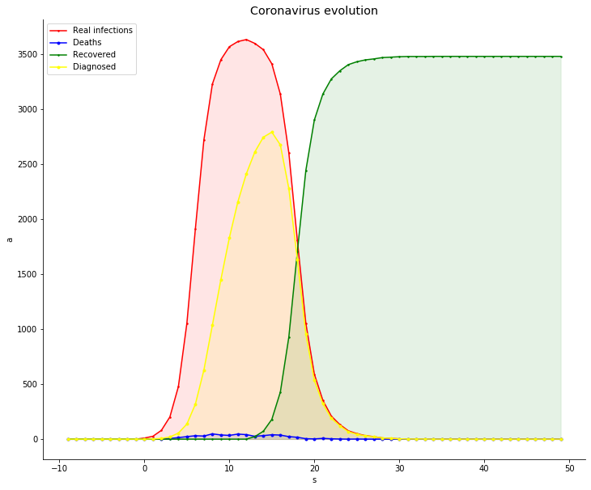
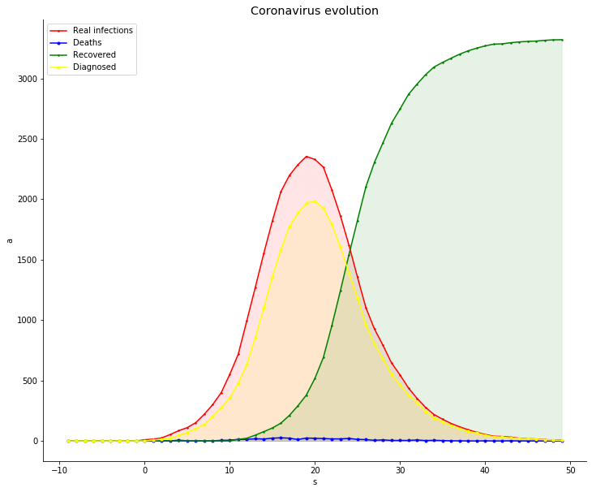
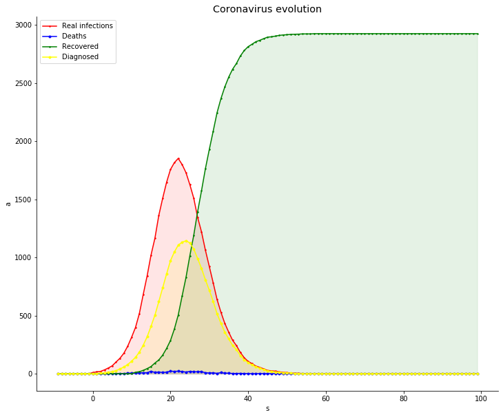
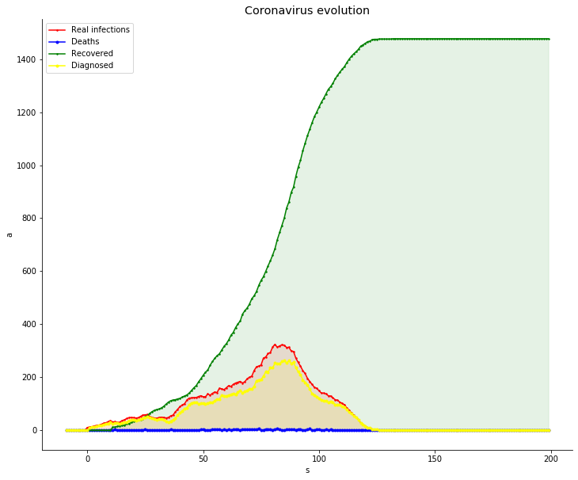

<h1><b>Simulation dynamics (SIMulation dynAMICS)</b></h1>

	Module created to simulate the population dynamics of a virus within a population. This module allows model the virus dynamic taking into account the population activity, size, space and number of diagnosed individuals. When an infected individual is diagnosed decreases their probability of infecting another individual. For more details of the implementation take a look the module documentation. Different parameters of the virus can be modified such as its mortality rate, transmission rate, percentage of each of the states it produces in the population, etc. Furthermore, it is necessary to define a function that models the number of interactions based on population size, space and movement. Several examples of functions are shown in the demo and in the <b>pre-built-functions.info</b> file.

<ul>
  <li>
    The main functions of the simulation are found in the <b>dynamic</b> submodule.
  </li>
  <li>
    The population and the individual implementation are located in the <b>population</b> sub-module.
  </li>
  <li>
    The <b>states</b> submodule defines the possible states that an individual may have. These are:
    <ul>
    	<li>Healthy.</li>
    	<li>Asymptomatic.</li>
    	<li>Symptomatic light.</li>
    	<li>Symptomatic mild.</li>
    	<li>Symptomatic severe.</li>
    	<li>Immunized.</li>
    </ul>
  </li>
  <li>
    The <b>visualization</b> submodule incorporates tools for simulation graphic representation.
  </li>  
</ul>

<h2>Some example results:</h2>

<h3>High Activity Low Test.</h3>

	

<h3>High Activity High Test.</h3>

	

<h3>Low Activity Low Test.</h3>

	

<h3>Low Activity High Test.</h3>

	

